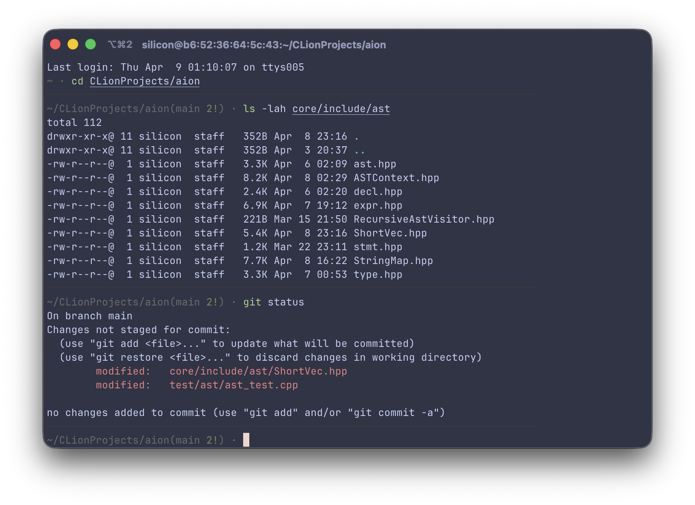

# Bored

Silicon's terminal theme, Bored.




Recommended settings for your terminal: 
- Catppuccin Frappe theme
- JetBrains Mono Font

---
## Setup

Bored has an intuitive installer: [setup.sh](setup.sh)

Copy-and-run:
```bash
git clone https://github.com/Silicon27/bored-zsh
cd bored-zsh
chmod +x setup.sh
./setup.sh
```

**Most of what you can see in the preview is adjustable. Follow the installation script for further details.** 

